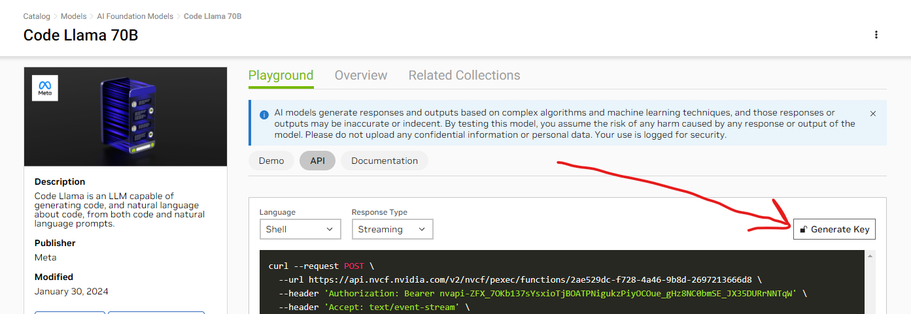

### How to run:
1. Create `.env` file
2. Inside `.env` add variable `VITE_NV_API_KEY` from this page: [link to page](https://catalog.ngc.nvidia.com/orgs/nvidia/teams/ai-foundation/models/codellama-70b/api)

3. Install dependencies:
   `pnpm install` or `npm install` or `yarn`
4. Build:
   `pnpm build` or `npm run build` or `yarn build`
5. Run:
   `pnpm start` or `npm run start` or `yarn start`